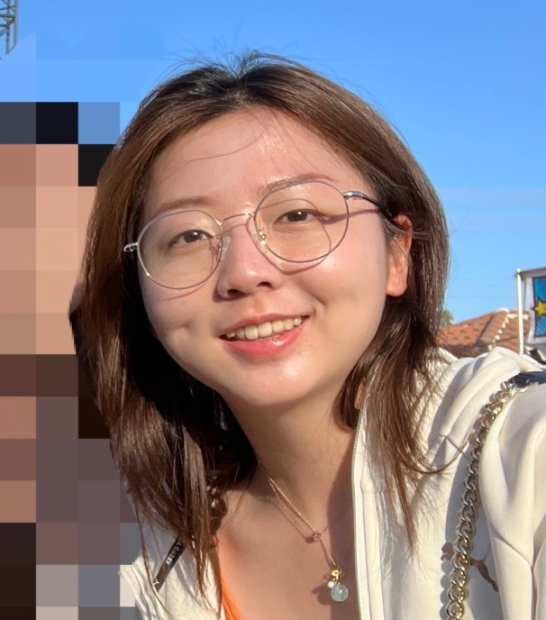

# DemiMao


## Who I am

    I am a junior year Math-CS major student from Sixth College. I'm from Shanghai, China. My favorite programming language is Python. I like to plan my schedule before coding and keep the style neat. It's a pleasure to meet every one!

[Funny Programmer Quotes](https://betterprogramming.pub/101-funny-programmer-quotes-76c7f335b92d)
> Copy-and-Paste was programmed by programmers for programmers actually.

## This is a piece of quoted code
```
Catch (Exception e) {
//who cares?
}
```


## Courses this quarter
- [ ] CSE 110
- [ ] CSE 158
- [ ] Math 170A
- [ ] CSE 170


[**My hobbies**](hobby.md) 

[*My contact*](contact.md)

[Back to top](#demimao)

    